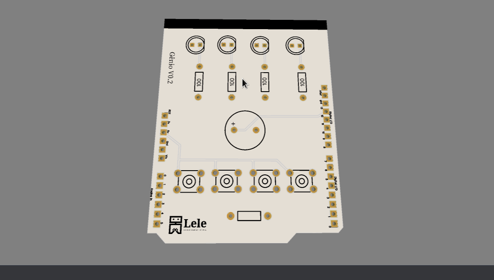
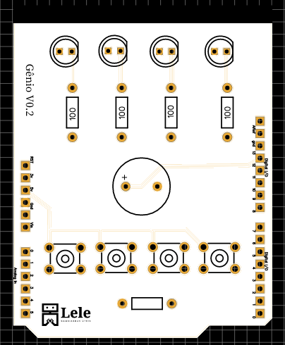

# PCB Simon-Says (Gênio)

## O que é este projeto?
Este projeto se trata de uma placa de circuito impresso (PCB) na forma de um shield para arduino uno para o jogo Gênio (ou simon says) onde uma sequência aleatória é gerada e o usuário deve repetir a sequência apertando os botões.

O projeto foi desenvolvido com o software **Easy EDA** e está disponível no compartilhamento da PCB way. Para acessá-lo, [clique aqui](https://www.pcbway.com/project/shareproject/Simon_Says_Arduino_Uno_Shield_13ca4bec.html).

## Como este projeto está estruturado?
* Gerber.zip: arquivos gerber do projeto;
* Project.zip: arquivos de desenvolvimento do projeto;
* Pasta imagens: contém imagens do projeto;
* Pasta genio: Código fonte do projeto 

## Componentes necessários para o projeto
A lista de componentes detalhada deste projeto pode ser encontrada na Mouser na forma de um carrinho de compras [clicando aqui.](https://www.mouser.com/ProjectManager/ProjectDetail.aspx?AccessID=DD460456D2)

Optei pela utilização de componentes PTH neste projeto porque o processo de solda é mais simples.

|Componente|Quantidade|Observação|
|:----------:|:----------:|:----------:|
| [Arduino Uno](https://br.mouser.com/ProductDetail/782-A000073)  | 1  | |
| [LED azul](https://www.mouser.com/ProductDetail/941-C503BBASCX0B0461)  |  1 |   |
| [LED vermelho](https://www.mouser.com/ProductDetail/941-C503BRCNCW0X0AA1)| 1 |   |   |
| [LED verde](https://www.mouser.com/ProductDetail/941-C503BGANCB0F0791)  |  1 |   |
| [LED amarelo](https://www.mouser.com/ProductDetail/941-C503BAANCY0B0251)  | 1  |   |
| [Resistor de 100 ohms](https://www.mouser.com/ProductDetail/594-5043ED100R0F)  | 5 | usado nos leds e no botão |
| [Piezo Buzzer](https://www.mouser.com/ProductDetail/497-IE122303-1)  | 1  |   |
| [Chave tátil](https://www.mouser.com/ProductDetail/506-1-1825910-4) | 4  |   |

